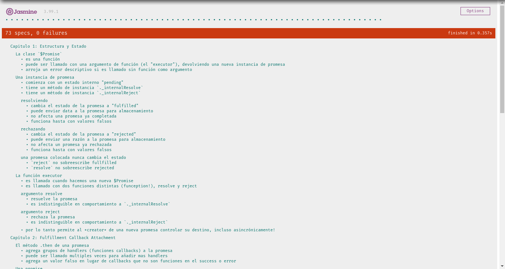

# **HW 04 Advanced Promises | Ejercicios**

## Tests


---

<br />

## **📌 INTRO**

Las promesas de JavaScript son herramientas versátiles para manejar resultados asincrónicos. Son portables y pueden adjuntar funciones a un valor eventual, en múltiples lugares. Comparado al callejón sin salida del standard de async callbacks, nos restauran un control flow mas normal - dejándonos conectar resultados secuenciales, retornar nuevos valores, y atrapar errores donde sea mas conveniente.

La forma de entender algo es construirla uno mismo. En este workshop construiremos una librería de un constructor de promesas similar al [ECMAScript `Promise`](https://developer.mozilla.org/en-US/docs/Web/JavaScript/Reference/Global_Objects/Promise), la cual llamaremos `pledge.js`

### Estado del Arte

#### Bluebird y Promises/A+

Siguiendo múltiples propuestas del [standard de promesas de CommonJs](http://wiki.commonjs.org/wiki/Promises), un standard destacado, [Promises/A+](https://www.promisejs.org/) ha ganado sobre el resto para convertirse en el standard de facto, siendo la base hasta el oficial [ES6 Promises](https://developer.mozilla.org/en-US/docs/Web/JavaScript/Reference/Global_Objects/Promise). Varios browsers los han implementado nativamente (incluyendo el engine de V8 que da poder a Chrome y Node), y [Bluebird](https://github.com/petkaantonov/bluebird) es también usada como una librería poderosa y de alto rendimiento.

> **ADVERTENCIA**: ¡Cuidado usuarios de código legacy de JQuery! Mientras que JQuery 2 tiene una versión de promesas a través de `$.Deferred`, esa implementación difiere de estándares actuales y es considereda defectuosa. Puedes mirar en [Kris Kowal's guide](https://github.com/kriskowal/q/wiki/Coming-from-jQuery). Sin embargo, usuarios de JQuery moderno alégrense! JQuery 3 ahora tiene unas promesas que obedecen P/A+ incluida.

---

<br />

## **📍 CONSIGNA**

Este workshop está basado en un test spec de [Jasmine 2](https://jasmine.github.io/2.5/introduction) (separado en capítulos temáticos). Nuestras promesas van a ser llamadas `$Promise` para evitar disparar código del browser. Para concentrarse en conceptos, `pledge.js` va a usar variables públicas y no va hacer obediente al standard.

---

<br />

## **📖 Pasos básicos para realizar la homework**

🔹 Para poder ejecutar los `test` de esta homework, es necesario que abramos la terminal ubicados dentro de la carpeta `01 - Exercises`.

-  Cuando te encuentres en esta carpeta, vamos a necesitar Node.js y su package manager npm instalado, para ello debes ejecutar el comando:

```bash
npm install
```

¡Listo! Ya puedes correr los test:

```bash
npm test
```

> Nota: Verás todos los tests como _"pending"_. Los tests están skippeados, por lo que debes sacar la 'x' a cada 'it'. Debes hacer los test en orden.

**IMPORTANTE:** Los tests se mostrarán de forma desordenada, para revertir esta situación, debes acceder desde la esquina superior derecha a **Options** y _quitar_ **"run tests in random order"** de las opciones seleccionadas.

---

<br />

## **ESTRUCTURA**

🔹 Dentro de la carpeta `01 - Exercises`, vas a encontrar la siguiente estructura:

-  Una carpeta llamada **docs**.
-  Una carpeta llamada **src**.
-  Una carpeta llamada `test`
-  Una carpeta llamada `utils`.
-  Un archivo `gulpfile.js`.
-  package.json
-  Un archivo `SpecRunner.html`
-  Y el archivo **README.md** que ahora mismo estás leyendo. 😙

🔹 Dentro de la carpeta `docs`, vas a encontrar la siguiente estructura y documentación que servirá de base para resolver la homework:

-  Una carpeta llamada `public`.
-  Un archivo llamado `docco.css`.
-  Un archivo llamado `pledge.spec.ch1`
-  Un archivo llamado `pledge.spec.ch2`
-  Un archivo llamado `pledge.spec.ch3`
-  Un archivo llamado `pledge.spec.ch4`
-  Un archivo llamado `pledge.spec.ch5`
-  Y el archivo `Promises Flowchart.pdf`

> Hint: El archivo **Promises Flowchart.pdf** lo necesitarás cuando te encuentres en el capítulo 4 del spec.

🔹 Dentro de la carpeta `src`, encontrarás el archivo `pledge.js`, es el archivo donde trabajarás.

> Recuerda que debes hacer los test en orden, comenzando con `pledge.spec.ch1.js`. Cuando lo completes, avanza al capítulo dos `pledge.spec.ch2.js` y así sucesivamente. Una vez realizado un spec y pase el test, no lo remuevas, ya que los test son acumulativos.

---

<br />

## **👩‍💻 EJERCICIO 1**

### **Pledge.spec.ch1**

📍 Dirígete al archivo `pledge.spec.ch1.html` que se encuentra dentro de la carpeta **docs**. Encontrarás el paso a paso para ir resolviendo el primer capítulo de este spec del lado izquierdo y del lado derecho los tests (de igual forma puedes ver los tests dentro de la carpeta **test**).

## **👩‍💻 EJERCICIO 2**

### **Pledge.spec.ch2**

📍 Dirígete al archivo `pledge.spec.ch2.html` que se encuentra dentro de la carpeta **docs**. Encontrarás el paso a paso para ir resolviendo el segundo capítulo de este spec.

## **👩‍💻 EJERCICIO 3**

### **Pledge.spec.ch3**

📍 Dirígete al archivo `pledge.spec.ch3.html` que se encuentra dentro de la carpeta **docs**. Encontrarás el paso a paso para ir resolviendo el tercer capítulo de este spec.

## **👩‍💻 EJERCICIO 4**

### **Pledge.spec.ch4**

📍 Dirígete al archivo `pledge.spec.ch4.html` que se encuentra dentro de la carpeta **docs**. Encontrarás el paso a paso para ir resolviendo el cuarto capítulo de este spec. Además abre el archivo **Promises Flowchart.pdf** que te ayudará en la resolución de este spec.

---

<br />

## **👩‍💻 Crédito Extra**

El capítulo 5 del spec es una sección opcional en dos importantes métodos de la librería, `Promise.resolve` (no es lo mismo que la función `resolver`) y `Promise.all`. Este capítulo es recomendado si tienes tiempo, pero considéralo crédito extra.

📍 Dirígete al archivo `pledge.spec.ch5.html` que se encuentra dentro de la carpeta **docs**. Encontrarás el paso a paso para ir resolviendo el último y quinto capítulo de este spec.

<br />

## **🧠 Recuerda que...**

-  Las promesas proporcionan un objeto que representa el estado de una función asincrónica y los valores que devuelve.

-  De acuerdo con el estado de las promesas establecidas, si están resueltas o rechazadas, puedes encadenar promesas para utilizar este estado.

-  Podemos encadenar promesas con los métodos del prototipo de objeto Promise: .then y .catch.

-  Promise.all es una función estática que combina una serie de promesas en una sola promesa.

---

<br />

## **🔎 Recursos adicionales**

-  _Una promesa representa el eventual resultado de una operación asincrónica._ - [Promises/A+](https://promisesaplus.com/)

-  El punto de las promesas es darnos devuelta composición funcional y _error bubbling_ en el mundo asincrónico. - [Domenic Denicola](https://blog.domenic.me/youre-missing-the-point-of-promises/)
