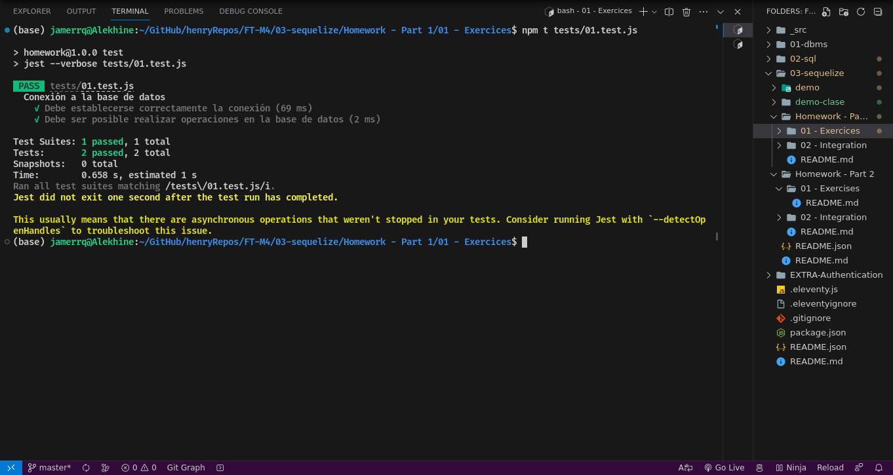
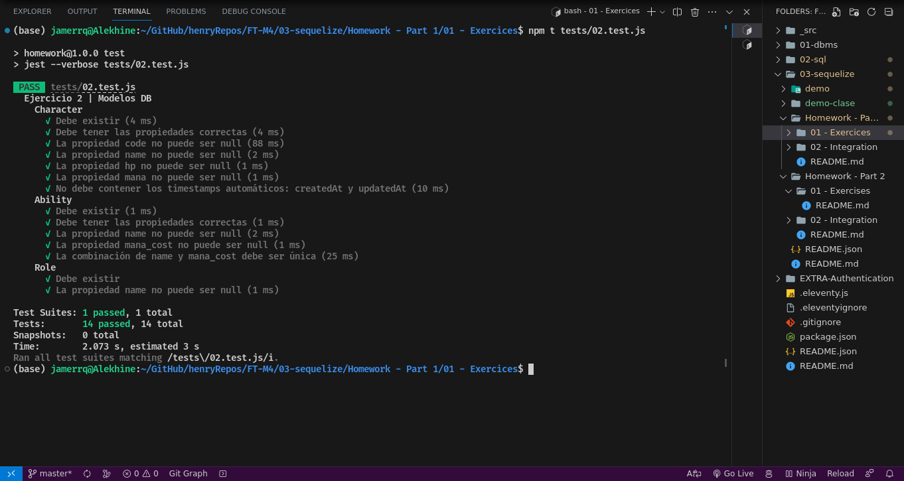
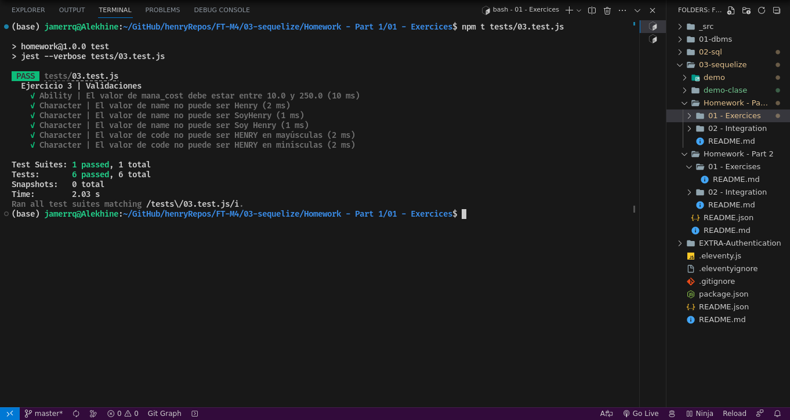
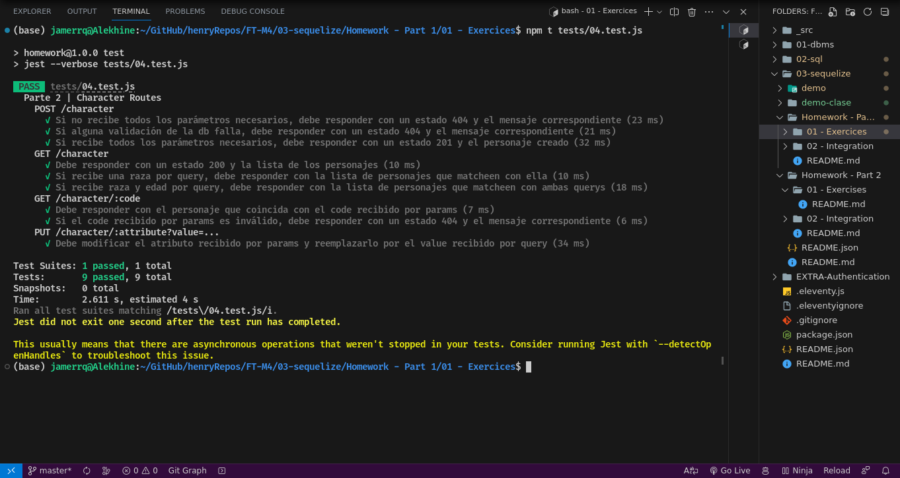

# **Módulo 4: Bases de Datos | Sequelize**

## Tests

## **📌 Temas de la homework**

-  Sequelize
-  Validaciones
-  Modelos
-  Querys

 

---

## **🕒 Duración total estimada**

x minutos

 

---

## **🔎 Aprendizaje esperado**

Al finalizar esta homework habrás:

-  Conectar código JavaScript con una base de datos de PostreSQL.
-  Crear modelos en Sequelize.
-  Validar los datos que se ingresan a las tablas.
-  Construir distintos funciones que realicen querys a la base de datos.

 

---

## **📎 TENER EN CUENTA**

¡Esta homework es la primera parte de Sequelize! Contiene tanto ejercicios como integración.

Te sugerimos que comiences a realizar la homework de ejercicios [**README**](./01%20-%20Exercises/README.md), para luego desarrollar la parte de integración [**README**](./02%20-%20Integration/README.md).

 

---

## **✅ FEEDBACK**

### Usa este [**formulario**](https://docs.google.com/forms/d/e/1FAIpQLSe1MybH_Y-xcp1RP0jKPLndLdJYg8cwyHkSb9MwSrEjoxyzWg/viewform) para reportar tus observaciones de mejora o errores. Tu feedback es muy importante para seguir mejorando el modelo educativo.
